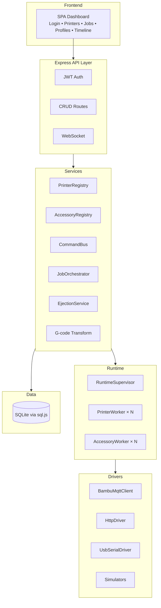

# 🚀 Antigravity — Build Walkthrough

## What Was Built

A complete **multi-printer orchestrator** for Bambu 3D printers — registry-driven, extensible, with automated cool-release ejection.

### Architecture Overview



---

## Files Created (47 source files + frontend)

| Layer | Files | Purpose |
|-------|-------|---------|
| **Database** | `src/db/database.js`, `src/db/migrations/001_initial_schema.sql` | sql.js (WASM) with auto-save, migrations |
| **Models** | 7 files in `src/models/` | Printer, Accessory, Command, Event, Job, JobRun, GcodeProfile |
| **G-code** | `src/gcode/GcodeTransformer.js` + 3 transforms + `cli.js` | Pipeline: prime line removal, AG markers, parking moves |
| **Drivers** | 6 files in `src/drivers/` | HTTP, MQTT, USB-Serial + DoorServo/EjectPusher simulators |
| **Services** | 7 files in `src/services/` | Registry, CommandBus, Ejection, Jobs, AMS |
| **Runtime** | `src/runtime/RuntimeSupervisor.js`, `PrinterWorker.js`, `AccessoryWorker.js` | Per-printer state machines, auto-dispatch |
| **API** | 6 route files + `router.js` + `websocket.js` | Full REST API + real-time WS |
| **Frontend** | `public/index.html` + `public/css/styles.css` + `public/js/app.js` | Premium dark SPA |

---

## Verification Results

### Server Boot
```
INFO  [DB] New database created at ./data/antigravity.db
INFO  [DB] Running migration: 001_initial_schema.sql
INFO  [Auth] Created default admin user: admin
INFO  [Server] Database initialized
INFO  [RuntimeSupervisor] Runtime started: 0 printers, 0 accessories
INFO  [Server] 🚀 Antigravity running at http://0.0.0.0:3000
INFO  [Server]    Mode: MOCK (simulators)
```

### API Smoke Test

| Endpoint | Result |
|----------|--------|
| `POST /api/auth/login` | ✅ JWT token returned |
| `POST /api/printers` | ✅ Printer created with auto-derived capabilities |
| `GET /api/printers` | ✅ Returns printer list |
| `GET /api/gcode/profiles` | ✅ 4 profiles: a1_default, p1s_default, x1c_default, universal |
| `GET /api/events` | ✅ `printer.registered` event logged |
| `GET /api/system/status` | ✅ Runtime supervisor running |

### Capability Auto-Derivation Example
Creating a "Bambu A1" printer automatically set: `mqtt_control: true, ams: true, camera: false, max_x: 256, max_y: 256, max_z: 256`

---

## How to Run

```bash
# Start server (mock mode)
node server.js

# Open dashboard
# http://localhost:3000
# Login: admin / antigravity

# G-code CLI
node src/gcode/cli.js transform -i input.gcode -o output.gcode --profile a1_default
```

## Key Design Decisions

1. **sql.js over better-sqlite3** — Pure JS/WASM, no native binaries needed (works on any Node version)
2. **Driver plugin system** — `MOCK_MODE=true` routes everything to simulators; production uses real HTTP/MQTT/Serial
3. **Command Bus** — All hardware interactions go through the command bus for idempotency, retry, timeout, and audit
4. **Cool-release ejection** — Waits for bed temp ≤27°C with hysteresis before activating servo pushers
